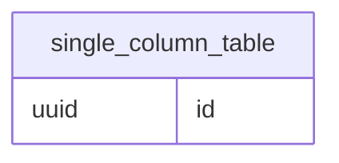
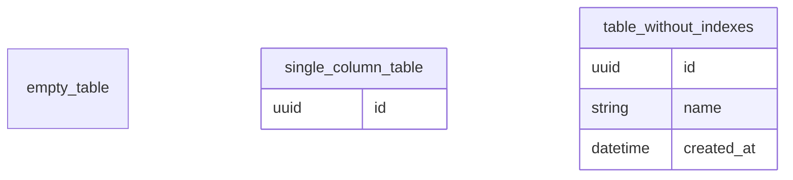
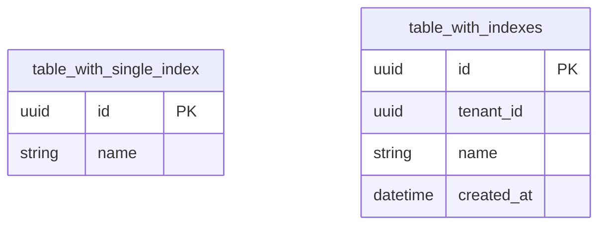
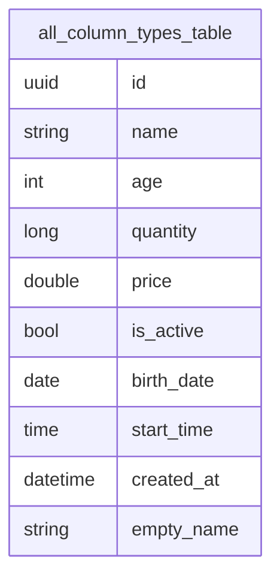
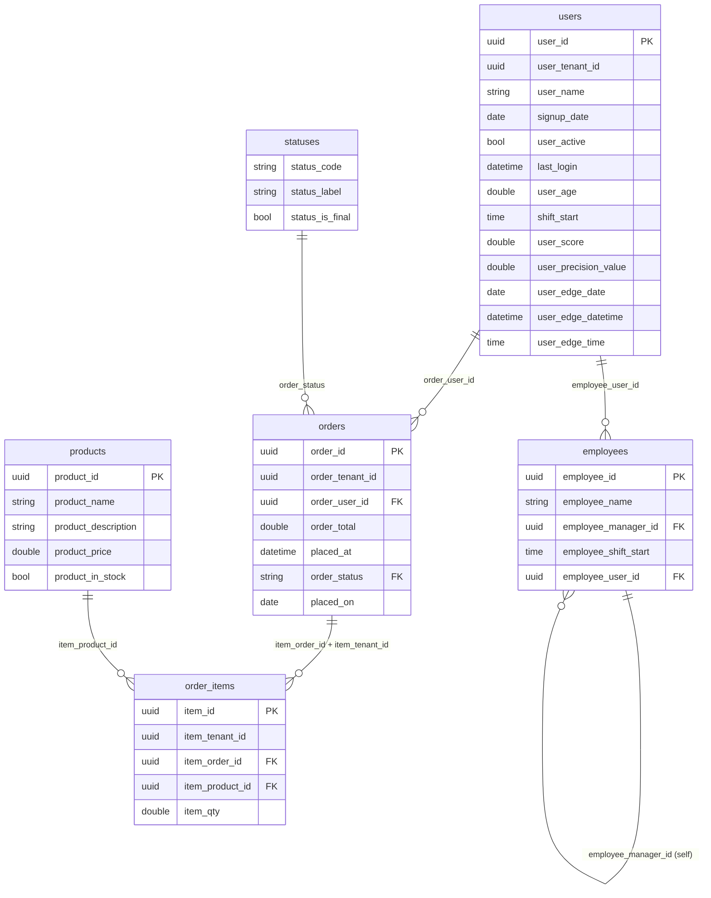
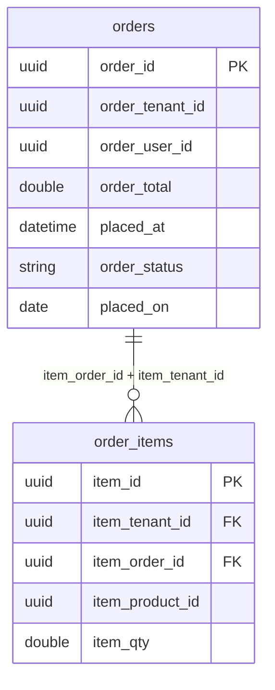
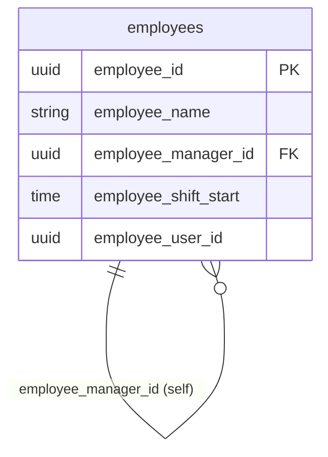
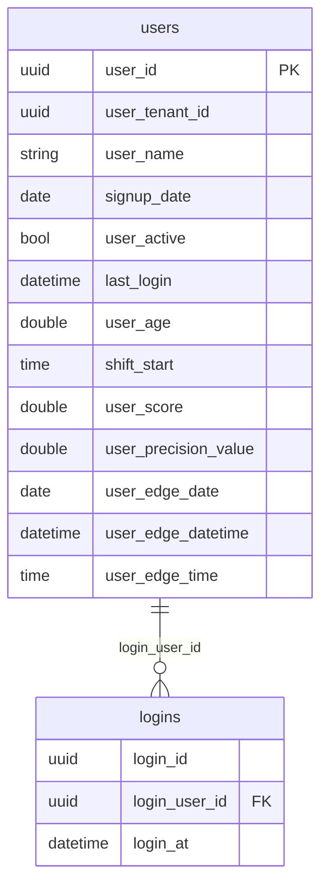
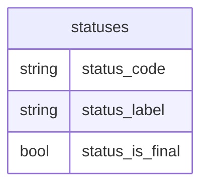
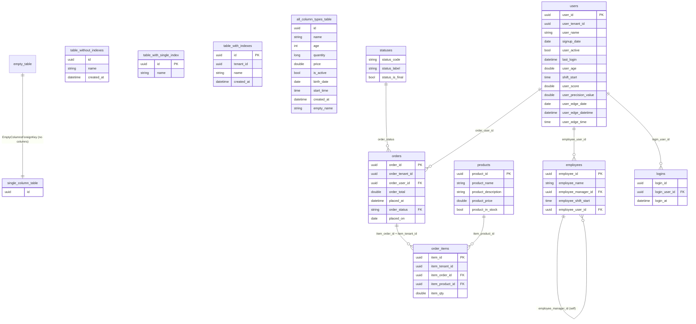

# Pure.RelationalSchema.Samples

Named, predefined `ISchema` instances — and the tables, columns, indexes, column types and foreign keys they are built from — for the **Pure** ecosystem.

[](https://github.com/kudima03/Pure.RelationalSchema.Samples/actions/workflows/build-and-test.yml)
[](https://github.com/kudima03/Pure.RelationalSchema.Samples/actions/workflows/publish-nuget.yml)
[](https://www.nuget.org/packages/Pure.RelationalSchema.Samples)
[](LICENSE)

## Overview

`Pure.RelationalSchema.Samples` provides a fixed, deterministic catalogue of relational schema shapes implemented as sealed records over the interfaces from `Pure.RelationalSchema.Abstractions`. Every sample is a concrete named type with a parameterless constructor and stable contents — nothing is random, nothing is generated.

The catalogue is graded from trivial to full-set, so a consumer can pick the exact shape it needs:

| Shape | Sample |
|---|---|
| Nothing at all | `EmptyRelationalSchema` |
| One table, one column | `SingleTableRelationalSchema` |
| Several tables, no relations | `RelationalSchemaWithoutForeignKeys` |
| Unique, non-unique and composite indexes | `RelationalSchemaWithIndexes` |
| Every column type in one table | `RelationalSchemaWithAllColumnTypes` |
| A query-grade domain, joined by foreign keys | `RelationalSchemaWithForeignKeys` |
| A multi-column relation | `RelationalSchemaWithCompositeForeignKey` |
| A table referencing itself | `RelationalSchemaWithSelfReferencingTable` |
| A domain referenced from another schema (uuid key, inbound) | `AuditRelationalSchema` |
| A domain referenced by another schema (string key, outbound) | `RefsRelationalSchema` |
| Everything at once | `FullRelationalSchema` |

Because samples are ordinary `ISchema`/`ITable`/`IColumn`/`IIndex`/`IForeignKey` implementations, they compose with the rest of the ecosystem — hashing, serialization, OpenAPI schemas, storage adapters and conditions — without any adapter code.

### Query-grade domains

`schema_with_foreign_keys`, `audit` and `refs` are the **query-grade** schemas: every column on every relation they hold is readable by a projection (`bool`, `date`, `datetime`, `double`, `string`, `time`, `uuid` — never `int`/`long`), and every column name is globally unique across all seven domain relations, so a cross-domain query never needs to qualify a bare field reference. The three schemas are joined by foreign keys crossing schema boundaries in both directions and on both key shapes a query engine can meet:

| Domain | Schema | Relation | Crossing edge | Join key type |
|---|---|---|---|---|
| core | `schema_with_foreign_keys` | `users`, `orders`, `products`, `order_items`, `employees` | — | — |
| audit | `audit` | `logins` | `logins.login_user_id` → `users.user_id` | uuid, inbound |
| refs | `refs` | `statuses` | `orders.order_status` → `statuses.status_code` | string, outbound |

`FullRelationalSchema` is the exhaustive fixture — it holds both the query-grade domain relations and the generic shape tables (`EmptyTable`, `SingleColumnTable`, `TableWithoutIndexes`, `TableWithSingleIndex`, `TableWithIndexes`, `AllColumnTypesTable`), so it is the one schema where `id`, `name`, `created_at` and `tenant_id` are deliberately ambiguous across relations. It is never a qualifier for a cross-domain query — use `schema_with_foreign_keys`, `audit` or `refs` for that.

### Domains

Each domain relation has exactly one home schema — the schema a cross-domain query qualifies it with. A relation may also appear in other sample schemas (`users` is also in `FullRelationalSchema`), but only its home is unambiguous:

| Relation | Home schema |
|---|---|
| `users`, `orders`, `products`, `order_items`, `employees` | `schema_with_foreign_keys` |
| `logins` | `audit` |
| `statuses` | `refs` |

### The join graph

Every domain relation is reachable from every other by following foreign keys in either direction; the longest cross-domain path touches all three schemas in three hops (`audit.logins` → `users` ← `orders` → `refs.statuses`):

```
        audit.logins ──login_user_id──┐
                                      ▼
  employees ──employee_user_id──▶  users  ◀──order_user_id── orders ──order_status──▶ refs.statuses
      │                                                        ▲
      └─manager_id─┘ (self)                                    │ (order_id, order_tenant_id)
                                                          order_items ──item_product_id──▶ products
```

## Schema Catalogue

```
Pure.RelationalSchema.Samples.Schemas/
├── EmptyRelationalSchema                    (empty_schema)
│
├── SingleTableRelationalSchema               (single_table_schema)
│   └── SingleColumnTable
│       └── id
│
├── RelationalSchemaWithoutForeignKeys        (schema_without_foreign_keys)
│   ├── EmptyTable
│   ├── SingleColumnTable
│   │   └── id
│   └── TableWithoutIndexes
│       ├── id
│       ├── name
│       └── created_at
│
├── RelationalSchemaWithIndexes               (schema_with_indexes)
│   ├── TableWithSingleIndex
│   │   ├── id
│   │   └── name
│   └── TableWithIndexes
│       ├── id
│       ├── tenant_id
│       ├── name
│       └── created_at
│
├── RelationalSchemaWithAllColumnTypes        (schema_with_all_column_types)
│   └── AllColumnTypesTable
│       ├── id
│       ├── name
│       ├── age
│       ├── quantity
│       ├── price
│       ├── is_active
│       ├── birth_date
│       ├── start_time
│       ├── created_at
│       └── (empty name)
│
├── RelationalSchemaWithForeignKeys           (schema_with_foreign_keys)  ← core domain, query-grade
│   ├── UsersTable       users        13 cols   all seven readable types
│   │   ├── user_id
│   │   ├── user_tenant_id
│   │   ├── user_name
│   │   ├── signup_date
│   │   ├── user_active
│   │   ├── last_login
│   │   ├── user_age
│   │   ├── shift_start
│   │   ├── user_score
│   │   ├── user_precision_value
│   │   ├── user_edge_date
│   │   ├── user_edge_datetime
│   │   └── user_edge_time
│   ├── OrdersTable       orders        7 cols
│   │   ├── order_id
│   │   ├── order_tenant_id
│   │   ├── order_user_id
│   │   ├── order_total
│   │   ├── placed_at
│   │   ├── order_status
│   │   └── placed_on
│   ├── ProductsTable     products      5 cols
│   │   ├── product_id
│   │   ├── product_name
│   │   ├── product_description
│   │   ├── product_price
│   │   └── product_in_stock
│   ├── OrderItemsTable   order_items   5 cols
│   │   ├── item_id
│   │   ├── item_tenant_id
│   │   ├── item_order_id
│   │   ├── item_product_id
│   │   └── item_qty
│   ├── EmployeesTable    employees     5 cols
│   │   ├── employee_id
│   │   ├── employee_name
│   │   ├── employee_manager_id
│   │   ├── employee_shift_start
│   │   └── employee_user_id
│   └── ForeignKeys
│       ├── SingleColumnForeignKey           orders.order_user_id → users.user_id
│       ├── CompositeForeignKey              order_items.(item_order_id, item_tenant_id)
│       │                                      → orders.(order_id, order_tenant_id)
│       ├── OrderItemsToProductsForeignKey   order_items.item_product_id → products.product_id
│       ├── SelfReferencingForeignKey        employees.employee_manager_id → employees.employee_id
│       ├── EmployeesToUsersForeignKey       employees.employee_user_id → users.user_id
│       └── OrdersToStatusesForeignKey       orders.order_status → statuses.status_code   ← cross-domain, string key
│
├── RelationalSchemaWithCompositeForeignKey   (schema_with_composite_foreign_key)
│   ├── OrdersTable       orders        7 cols   (see above)
│   ├── OrderItemsTable   order_items   5 cols   (see above)
│   └── ForeignKeys
│       └── CompositeForeignKey        order_items.(item_order_id, item_tenant_id)
│                                         → orders.(order_id, order_tenant_id)
│
├── RelationalSchemaWithSelfReferencingTable  (schema_with_self_referencing_table)
│   ├── EmployeesTable    employees     5 cols   (see above)
│   └── ForeignKeys
│       └── SelfReferencingForeignKey  employees.employee_manager_id → employees.employee_id
│
├── AuditRelationalSchema                      (audit)   ← audit domain
│   └── LoginsTable       logins        3 cols
│       ├── login_id
│       ├── login_user_id
│       └── login_at
│       └── ForeignKeys
│           └── LoginsToUsersForeignKey   logins.login_user_id → users.user_id   ← cross-domain, uuid key
│
├── RefsRelationalSchema                       (refs)   ← refs domain, referenced only
│   └── StatusesTable     statuses      3 cols
│       ├── status_code
│       ├── status_label
│       └── status_is_final
│
└── FullRelationalSchema                      (full_schema)
    ├── EmptyTable
    ├── SingleColumnTable
    │   └── id
    ├── TableWithoutIndexes
    │   ├── id
    │   ├── name
    │   └── created_at
    ├── TableWithSingleIndex
    │   ├── id
    │   └── name
    ├── TableWithIndexes
    │   ├── id
    │   ├── tenant_id
    │   ├── name
    │   └── created_at
    ├── AllColumnTypesTable
    │   ├── id
    │   ├── name
    │   ├── age
    │   ├── quantity
    │   ├── price
    │   ├── is_active
    │   ├── birth_date
    │   ├── start_time
    │   ├── created_at
    │   └── (empty name)
    ├── UsersTable        users         13 cols   (see above)
    ├── OrdersTable       orders         7 cols   (see above)
    ├── ProductsTable     products       5 cols   (see above)
    ├── OrderItemsTable   order_items    5 cols   (see above)
    ├── EmployeesTable    employees      5 cols   (see above)
    ├── LoginsTable       logins         3 cols   (see above)
    ├── StatusesTable     statuses       3 cols   (see above)
    └── ForeignKeys
        ├── EmptyColumnsForeignKey          empty_table.() → single_column_table.()
        ├── SingleColumnForeignKey          orders.order_user_id → users.user_id
        ├── CompositeForeignKey             order_items.(item_order_id, item_tenant_id)
        │                                     → orders.(order_id, order_tenant_id)
        ├── OrderItemsToProductsForeignKey  order_items.item_product_id → products.product_id
        ├── SelfReferencingForeignKey       employees.employee_manager_id → employees.employee_id
        ├── LoginsToUsersForeignKey         logins.login_user_id → users.user_id
        ├── OrdersToStatusesForeignKey      orders.order_status → statuses.status_code
        └── EmployeesToUsersForeignKey      employees.employee_user_id → users.user_id
```

## Entity-Relationship Diagrams

One diagram per `ISchema` sample, in the same order as the grading table above. Each
diagram reflects exactly that schema's own `Tables` and `ForeignKeys` collections —
`PK`/`FK` markers, and the relationship lines themselves, are per-schema facts, not
universal facts about a column. For example, `orders.order_user_id` is a foreign-key
column wherever `SingleColumnForeignKey` is in scope, but is drawn as a plain column in
`schema_with_composite_foreign_key`, which does not include that foreign key. A `PK`
marker means the column is covered by a unique `IIndex` sample on that table (see
[Indexes](#indexes)); `logins` and `statuses` declare no indexes at all, so their natural
keys (`login_id`, `status_code`) are drawn unmarked, matching the source exactly.

Where a foreign key crosses into a table that is not itself a member of the schema (a
foreign key is listed in the schema of its *referencing* relation — see
[Query-grade domains](#query-grade-domains)), the referenced table is still drawn so the
edge renders, with a note underneath naming its real home schema.

### `empty_schema` — `EmptyRelationalSchema`

No tables and no foreign keys — nothing to diagram.

### `single_table_schema` — `SingleTableRelationalSchema`



### `schema_without_foreign_keys` — `RelationalSchemaWithoutForeignKeys`



No foreign keys connect these tables — the sample exists to exercise a multi-table,
relation-free schema.

### `schema_with_indexes` — `RelationalSchemaWithIndexes`



No foreign keys — the sample exercises unique, non-unique and composite indexes, not
relations. `tenant_id` on `table_with_indexes` is also covered by `CompositeUniqueIndex`
alongside `id`; only single-column primary keys are marked `PK` here to keep the diagram
readable.

### `schema_with_all_column_types` — `RelationalSchemaWithAllColumnTypes`



`empty_name` stands in for `EmptyNameColumn`, whose real `Name` is the empty string.

### `schema_with_foreign_keys` — `RelationalSchemaWithForeignKeys` (core domain, query-grade)



`statuses` is not a member table of this schema. `OrdersToStatusesForeignKey` is listed
here because it is homed with its referencing relation (`orders`), but `statuses` itself
is homed in `refs` — it is drawn only to render the crossing edge.

### `schema_with_composite_foreign_key` — `RelationalSchemaWithCompositeForeignKey`



### `schema_with_self_referencing_table` — `RelationalSchemaWithSelfReferencingTable`



### `audit` — `AuditRelationalSchema`



`users` is not a member table of `audit` — drawn only to render
`LoginsToUsersForeignKey`'s crossing edge; its home schema is `schema_with_foreign_keys`.

### `refs` — `RefsRelationalSchema`



No foreign keys — `refs` is a leaf domain, referenced only (see
[Query-grade domains](#query-grade-domains)).

### `full_schema` — `FullRelationalSchema`

Every table and every foreign key in the catalogue — the union of all diagrams above.



## Schemas

`namespace Pure.RelationalSchema.Samples.Schemas`

| Class | `Name` | Tables | Foreign keys |
|---|---|---|---|
| `EmptyRelationalSchema` | `empty_schema` | 0 | 0 |
| `SingleTableRelationalSchema` | `single_table_schema` | 1 | 0 |
| `RelationalSchemaWithoutForeignKeys` | `schema_without_foreign_keys` | 3 | 0 |
| `RelationalSchemaWithIndexes` | `schema_with_indexes` | 2 | 0 |
| `RelationalSchemaWithAllColumnTypes` | `schema_with_all_column_types` | 1 | 0 |
| `RelationalSchemaWithForeignKeys` | `schema_with_foreign_keys` | 5 | 6 |
| `RelationalSchemaWithCompositeForeignKey` | `schema_with_composite_foreign_key` | 2 | 1 |
| `RelationalSchemaWithSelfReferencingTable` | `schema_with_self_referencing_table` | 1 | 1 |
| `AuditRelationalSchema` | `audit` | 1 | 1 |
| `RefsRelationalSchema` | `refs` | 1 | 0 |
| `FullRelationalSchema` | `full_schema` | 13 | 8 |

## Tables

`namespace Pure.RelationalSchema.Samples.Tables`

| Class | `Name` | Columns | Indexes |
|---|---|---|---|
| `EmptyTable` | `empty_table` | 0 | 0 |
| `EmptyNameTable` | *(empty string)* | 0 | 0 |
| `SingleColumnTable` | `single_column_table` | 1 | 0 |
| `TableWithoutIndexes` | `table_without_indexes` | 3 | 0 |
| `TableWithSingleIndex` | `table_with_single_index` | 2 | 1 |
| `TableWithIndexes` | `table_with_indexes` | 4 | 4 |
| `AllColumnTypesTable` | `all_column_types_table` | 10 | 0 |
| `UsersTable` | `users` | 13 | 2 |
| `OrdersTable` | `orders` | 7 | 2 |
| `ProductsTable` | `products` | 5 | 1 |
| `OrderItemsTable` | `order_items` | 5 | 1 |
| `EmployeesTable` | `employees` | 5 | 1 |
| `LoginsTable` | `logins` | 3 | 0 |
| `StatusesTable` | `statuses` | 3 | 0 |

## Foreign Keys

`namespace Pure.RelationalSchema.Samples.ForeignKeys`

| Class | Referencing | Referenced |
|---|---|---|
| `EmptyColumnsForeignKey` | `empty_table` *(no columns)* | `single_column_table` *(no columns)* |
| `SingleColumnForeignKey` | `orders.order_user_id` | `users.user_id` |
| `CompositeForeignKey` | `order_items.item_order_id`, `order_items.item_tenant_id` | `orders.order_id`, `orders.order_tenant_id` |
| `SelfReferencingForeignKey` | `employees.employee_manager_id` | `employees.employee_id` |
| `OrderItemsToProductsForeignKey` | `order_items.item_product_id` | `products.product_id` |
| `LoginsToUsersForeignKey` | `logins.login_user_id` | `users.user_id` |
| `OrdersToStatusesForeignKey` | `orders.order_status` | `statuses.status_code` |
| `EmployeesToUsersForeignKey` | `employees.employee_user_id` | `users.user_id` |

## Indexes

`namespace Pure.RelationalSchema.Samples.Indexes`

| Class | Unique | Columns |
|---|---|---|
| `EmptyIndex` | no | *(none)* |
| `EmptyUniqueIndex` | yes | *(none)* |
| `SingleColumnUniqueIndex` | yes | `id` |
| `SingleColumnNonUniqueIndex` | no | `name` |
| `CompositeUniqueIndex` | yes | `tenant_id`, `id` |
| `CompositeNonUniqueIndex` | no | `name`, `created_at` |
| `DuplicateColumnsIndex` | no | `id`, `id` |
| `UsersPrimaryIndex` | yes | `user_id` |
| `UsersNameIndex` | no | `user_name` |
| `OrdersPrimaryIndex` | yes | `order_id` |
| `OrdersTenantUniqueIndex` | yes | `order_tenant_id`, `order_id` |
| `ProductsPrimaryIndex` | yes | `product_id` |
| `OrderItemsPrimaryIndex` | yes | `item_id` |
| `EmployeesPrimaryIndex` | yes | `employee_id` |

## Columns

`namespace Pure.RelationalSchema.Samples.Columns`

| Class | `Name` | Type |
|---|---|---|
| `IdColumn` | `id` | `UuidColumnType` |
| `NameColumn` | `name` | `StringColumnType` |
| `DescriptionColumn` | `description` | `StringColumnType` |
| `AgeColumn` | `age` | `IntColumnType` |
| `QuantityColumn` | `quantity` | `LongColumnType` |
| `PriceColumn` | `price` | `DoubleColumnType` |
| `IsActiveColumn` | `is_active` | `BoolColumnType` |
| `BirthDateColumn` | `birth_date` | `DateColumnType` |
| `StartTimeColumn` | `start_time` | `TimeColumnType` |
| `CreatedAtColumn` | `created_at` | `DateTimeColumnType` |
| `UserIdColumn` | `user_id` | `UuidColumnType` |
| `OrderIdColumn` | `order_id` | `UuidColumnType` |
| `ProductIdColumn` | `product_id` | `UuidColumnType` |
| `ManagerIdColumn` | `manager_id` | `UuidColumnType` |
| `TenantIdColumn` | `tenant_id` | `UuidColumnType` |
| `EmptyNameColumn` | *(empty string)* | `EmptyNameColumnType` |
| `UserTenantIdColumn` | `user_tenant_id` | `UuidColumnType` |
| `UserNameColumn` | `user_name` | `StringColumnType` |
| `UserAgeColumn` | `user_age` | `DoubleColumnType` |
| `UserActiveColumn` | `user_active` | `BoolColumnType` |
| `SignupDateColumn` | `signup_date` | `DateColumnType` |
| `LastLoginColumn` | `last_login` | `DateTimeColumnType` |
| `ShiftStartColumn` | `shift_start` | `TimeColumnType` |
| `UserScoreColumn` | `user_score` | `DoubleColumnType` |
| `UserPrecisionValueColumn` | `user_precision_value` | `DoubleColumnType` |
| `UserEdgeDateColumn` | `user_edge_date` | `DateColumnType` |
| `UserEdgeDateTimeColumn` | `user_edge_datetime` | `DateTimeColumnType` |
| `UserEdgeTimeColumn` | `user_edge_time` | `TimeColumnType` |
| `OrderTenantIdColumn` | `order_tenant_id` | `UuidColumnType` |
| `OrderUserIdColumn` | `order_user_id` | `UuidColumnType` |
| `OrderTotalColumn` | `order_total` | `DoubleColumnType` |
| `OrderStatusColumn` | `order_status` | `StringColumnType` |
| `PlacedAtColumn` | `placed_at` | `DateTimeColumnType` |
| `PlacedOnColumn` | `placed_on` | `DateColumnType` |
| `ProductNameColumn` | `product_name` | `StringColumnType` |
| `ProductDescriptionColumn` | `product_description` | `StringColumnType` |
| `ProductPriceColumn` | `product_price` | `DoubleColumnType` |
| `ProductInStockColumn` | `product_in_stock` | `BoolColumnType` |
| `ItemIdColumn` | `item_id` | `UuidColumnType` |
| `ItemTenantIdColumn` | `item_tenant_id` | `UuidColumnType` |
| `ItemOrderIdColumn` | `item_order_id` | `UuidColumnType` |
| `ItemProductIdColumn` | `item_product_id` | `UuidColumnType` |
| `ItemQtyColumn` | `item_qty` | `DoubleColumnType` |
| `EmployeeIdColumn` | `employee_id` | `UuidColumnType` |
| `EmployeeNameColumn` | `employee_name` | `StringColumnType` |
| `EmployeeManagerIdColumn` | `employee_manager_id` | `UuidColumnType` |
| `EmployeeShiftStartColumn` | `employee_shift_start` | `TimeColumnType` |
| `EmployeeUserIdColumn` | `employee_user_id` | `UuidColumnType` |
| `LoginIdColumn` | `login_id` | `UuidColumnType` |
| `LoginUserIdColumn` | `login_user_id` | `UuidColumnType` |
| `LoginAtColumn` | `login_at` | `DateTimeColumnType` |
| `StatusCodeColumn` | `status_code` | `StringColumnType` |
| `StatusLabelColumn` | `status_label` | `StringColumnType` |
| `StatusIsFinalColumn` | `status_is_final` | `BoolColumnType` |

## Column Types

`namespace Pure.RelationalSchema.Samples.ColumnTypes`

| Class | `Name` |
|---|---|
| `BoolColumnType` | `bool` |
| `IntColumnType` | `int` |
| `LongColumnType` | `long` |
| `DoubleColumnType` | `double` |
| `StringColumnType` | `string` |
| `UuidColumnType` | `uuid` |
| `DateColumnType` | `date` |
| `TimeColumnType` | `time` |
| `DateTimeColumnType` | `datetime` |
| `EmptyNameColumnType` | *(empty string)* |

`int` and `long` appear only on the shape tables (`AllColumnTypesTable` and friends) — no domain relation carries either, so every domain column is projection-readable.

## Dependencies

- [`Pure.RelationalSchema.Abstractions` 1.2.0](https://github.com/kudima03/Pure.RelationalSchema.Abstractions/tree/1.2.0) — the interfaces every sample implements (`ISchema`, `ITable`, `IColumn`, `IColumnType`, `IIndex`, `IForeignKey`)
- [`Pure.Primitives` 3.6.5](https://github.com/kudima03/Pure.Primitives/tree/3.6.5) — `String`, `True` and `False` used for sample names and index uniqueness

No implementation package (`Pure.RelationalSchema` and friends) is referenced, so the samples can be consumed by any repository in the ecosystem — including the implementations themselves — without a dependency cycle.

## Target Frameworks

- .NET 7
- .NET 8
- .NET 9
- .NET 10

## Installation

```bash
dotnet add package Pure.RelationalSchema.Samples
```

## Usage

```csharp
using Pure.RelationalSchema.Abstractions.Schema;
using Pure.RelationalSchema.Samples.Schemas;

ISchema schema = new FullRelationalSchema();

// schema.Name.TextValue      == "full_schema"
// schema.Tables.Count()      == 13
// schema.ForeignKeys.Count() == 8
```

Underlying components are usable on their own:

```csharp
using Pure.RelationalSchema.Abstractions.ForeignKey;
using Pure.RelationalSchema.Abstractions.Table;
using Pure.RelationalSchema.Samples.ForeignKeys;
using Pure.RelationalSchema.Samples.Tables;

ITable table = new UsersTable();
IForeignKey foreignKey = new CompositeForeignKey();
```

Samples are deterministic, so they compare equal across instances by structural hash:

```csharp
using Pure.RelationalSchema.HashCodes;
using Pure.RelationalSchema.Samples.Tables;

bool same = new TableHash(new UsersTable()).SequenceEqual(new TableHash(new UsersTable()));
// true
```
